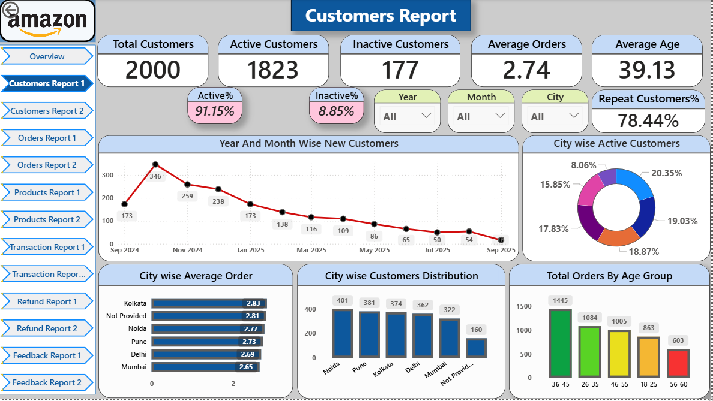
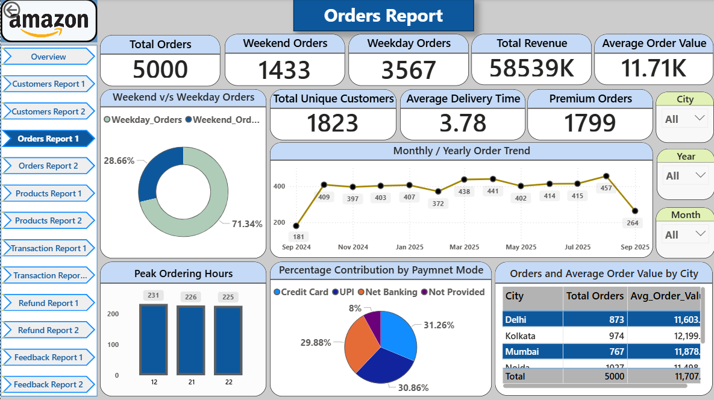
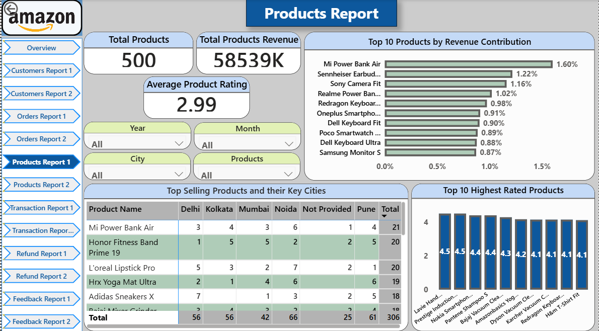
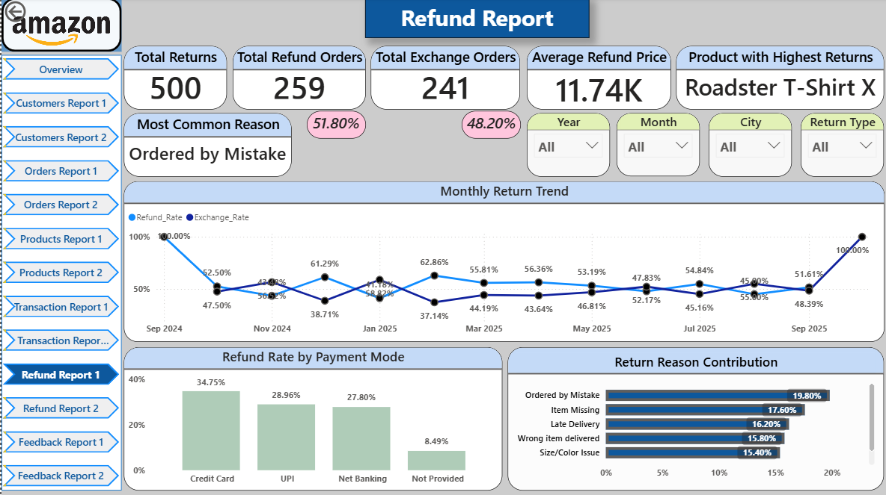
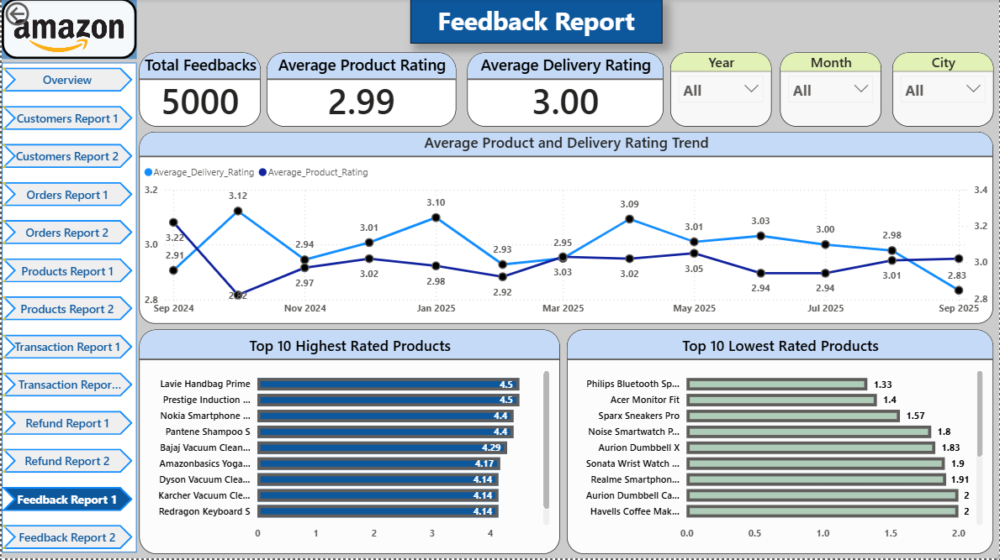

# 🛒 Amazon E-commerce Analytics Capstone Project

### End-to-end project analyzing Amazon E-commerce data using Python, MySQL, and Power BI — uncovering customer behavior, sales trends, and feedback insights.

---

## ⚙️ Project Workflow
1️⃣ **Python (Pandas):** Data extraction & cleaning (6 relational tables).  
2️⃣ **MySQL:** KPI and analytical insights (sales, revenue, refunds, customer retention).  
3️⃣ **Power BI:** 13-page interactive dashboard for business decision support.

---

## 📊 Key Highlights
👥 **Customers:** Top 3 cities, most active age group, repeat customer rate, top spenders  
📦 **Orders:** Monthly trends, city-wise revenue, premium order share  
🛍️ **Products:** Top-performing products, most refunded items, average delivery ratings  
💳 **Transactions:** Payment mode share, city-wise preference, refund trends  
🔁 **Refunds:** Common return reasons, highly returned products, monthly return trends  
⭐ **Feedback:** Rating trends, top & lowest-rated products

---

## 🖥️ Power BI Dashboard Snapshots

Below are some of the key pages from my 13-page Power BI report.  
Each page focuses on a different business area of Amazon’s E-commerce operations.

---

### 📊 Dashboard Overview

---

### 👥 Customers Report  

---

### 📦 Orders Report  

---

### 🛍️ Products Report  

---

### 💳 Transactions Report  

---

### 🔁 Refunds Report  

---

### ⭐ Feedbacks Report  

---

> 📁 *Note: The `visuals` folder contains all 13 Power BI pages (1 overview + 12 detailed reports). Only the key pages are shown above for preview.*

